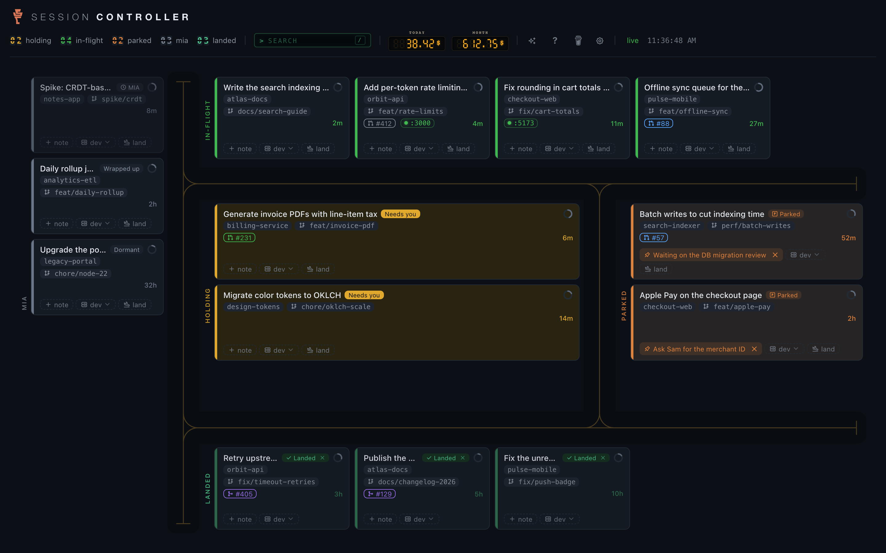
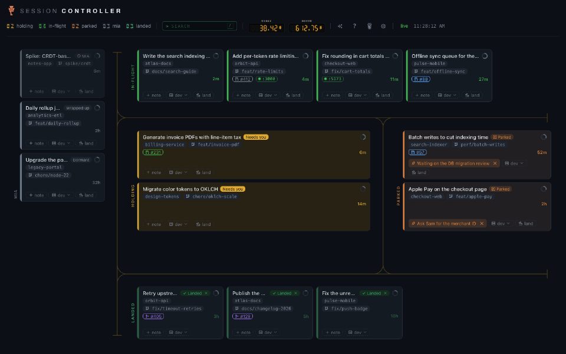
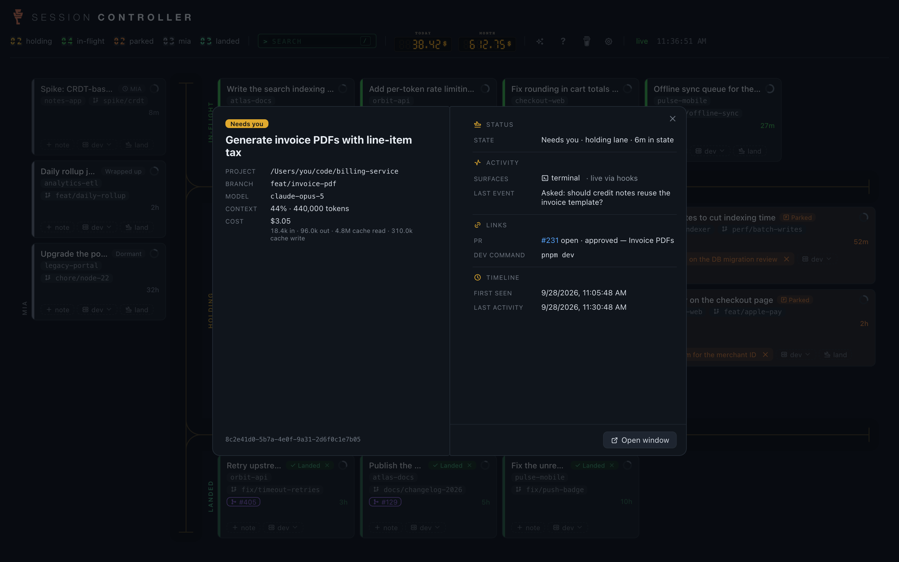
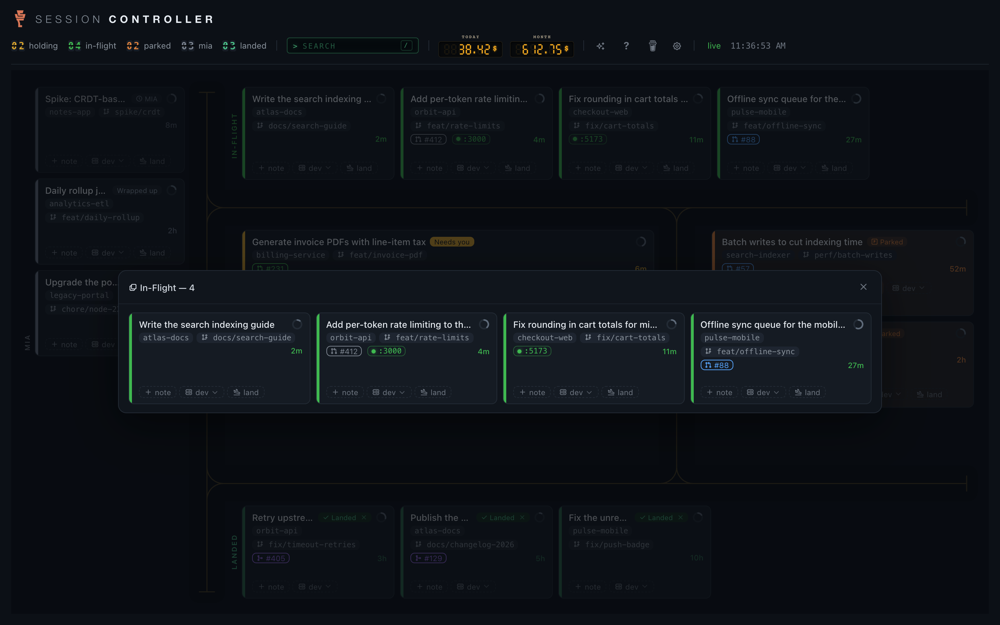

<div align="center">
  
  <h1>Session Controller</h1>
  <p><strong>An air-traffic-control dashboard for running multiple Claude Code sessions in parallel.</strong></p>
  <p>See every Claude Code session at a glance, know which one is waiting on you, and jump straight back into it.</p>
  <p>
    
    
    
  </p>
</div>

<p align="center">
  
</p>

Running several Claude Code agents at once means constantly checking terminal tabs to see which one
finished, which one is asking a question, and which one quietly stalled. Session Controller watches all
of them for you. Every Claude session, whether it's the Claude Code CLI in a terminal or the Claude
desktop app, shows up automatically as a live **flight strip**, and strips move between lanes as their
state changes. It's a local macOS menu-bar app with a browser dashboard, and it never writes to
Claude's files. See [CONCEPT.md](CONCEPT.md) for the full design.

## Install

```bash
curl -fsSL https://raw.githubusercontent.com/DavidMueller1/session-controller/main/install.sh | bash
```

This clones the repo into `~/Library/Application Support/Session Controller/repo`, builds a
menu-bar app on your Mac, wires the tracking hooks, and adds a Login Item. Because the app is built
locally, there's no Gatekeeper prompt. The dashboard runs at <http://127.0.0.1:4317>.

Requirements: macOS and [Claude Code](https://code.claude.com). The [GitHub CLI](https://cli.github.com)
(`gh`) is optional and only needed for the PR pills.

## Features

- **Live status for every session:** working, waiting for your answer, idle, or done, driven by
  Claude Code hooks, so a strip moves the moment a session changes state.
- **Knows which session needs you:** a strip flashes when a session ends its turn or asks a question,
  and optional desktop notifications ping you.
- **Jump back in with one click:** clicking a strip's title focuses the exact iTerm2 or Terminal.app
  tab, the matching JetBrains IDE window, or the Claude desktop app. If you closed the terminal tab,
  it reopens the session with `claude --resume`.
- **Triage with notes:** add a note to set a "needs you" session aside in **Parked**, and mark finished
  work as **Landed**.
- **Search:** filter the board by title, branch, or folder (press `/`).
- **Pull requests:** a PR pill per branch via `gh`, coloured by review state.
- **Dev servers:** detect, start, and stop the dev server in each strip's folder, and tail its logs.
- **Cost tracking:** today's and this month's API-equivalent token cost, plus a breakdown per session.
- **Context usage:** a ring on each strip shows how full its context window is.

<p align="center">
  
</p>

## The board

Strips move between lanes as each session's state changes:

| Lane | Meaning |
|---|---|
|  | working now |
|  | waiting on you: its turn ended, or it called `AskUserQuestion` / `ExitPlanMode` (flashes) |
|  | a "needs you" strip you triaged by adding a note |
|  | lost contact: quiet for 5+ minutes, or wrapped up |
|  | you marked it done |

- Every lane scrolls, so it can hold any number of strips. Click a lane's name to see all of its
  strips as a grid.
- Sessions idle for **more than 5 days drop off** the board, unless they have a note.
- A merged PR flags the strip 
  (cleared to land). Landing stays a manual click.

<table>
  <tr>
    <td></td>
    <td></td>
  </tr>
  <tr>
    <td align="center"><sub>Click a strip for its details</sub></td>
    <td align="center"><sub>Click a lane's name for the grid</sub></td>
  </tr>
</table>

## Auto-update

The app keeps itself current. It checks `main` shortly after launch and every 30 minutes (or when you
click *Check for Updates Now*), then pulls, rebuilds only what changed, and restarts, relaunching
itself if the app bundle changed. **Pushing to `main` ships to everyone.** Board state
(`…/Session Controller/data`) is never touched by an update.

## Tracking hooks

Live state comes from a few Claude Code hooks that write `~/.claude/tc-state/*.json`. `install.sh`
wires them idempotently (via `pnpm run doctor`). If a Claude update ever rewrites
`~/.claude/settings.json` and drops them, a banner appears at the top of the board. The app re-wires
them on its next update, or you can run `pnpm run doctor` yourself.

## FAQ

**How do I keep track of multiple Claude Code sessions at once?**
Install Session Controller and keep the dashboard open. Every session appears on its own, with no
per-session setup, and a flashing strip (plus an optional notification) tells you which one is
waiting for your answer.

**Does it send my code or conversations anywhere?**
No. It reads Claude's local session files and runs entirely on your Mac, with no account and no
telemetry. Its only network calls are the Claude status page, `gh` for PR pills, and the self-update
from this repository.

**Does it work with the Claude desktop app?**
Yes. Desktop sessions show up next to CLI sessions, and a session you run in both places is merged
into one strip.

**Which terminals can it jump to?**
It focuses the exact tab in iTerm2 and Terminal.app, and the matching project window in JetBrains
IDEs. For other terminals it brings the app to the front.

**What does the cost figure mean?**
It's what your tokens would cost at API list prices. On a Pro or Max subscription that isn't an
amount you're billed.

## Develop

```bash
nvm use                # Node 22 (from .nvmrc)
pnpm run setup         # deps + build UI + wire hooks   (NB: `run setup`, not `pnpm setup`)
pnpm serve             # server + built UI on :4317
pnpm ui                # Vite dev server on :5173 (HMR), proxies to :4317
pnpm dev:live          # both of the above against the INSTALLED app's DB — instant changes, same data
pnpm typecheck
pnpm screenshots       # regenerate docs/screenshots from demo mode (?demo), no real data involved
```

Open the dashboard with `?demo` to see it filled with made-up sessions (`?demo=tour` also animates a
few lane changes). Demo mode never connects to the backend.

---

<sub>If Session Controller saves you some tab-hunting, you can <a href="https://buymeacoffee.com/davidsaysthankyou">buy me a coffee</a>.</sub>
